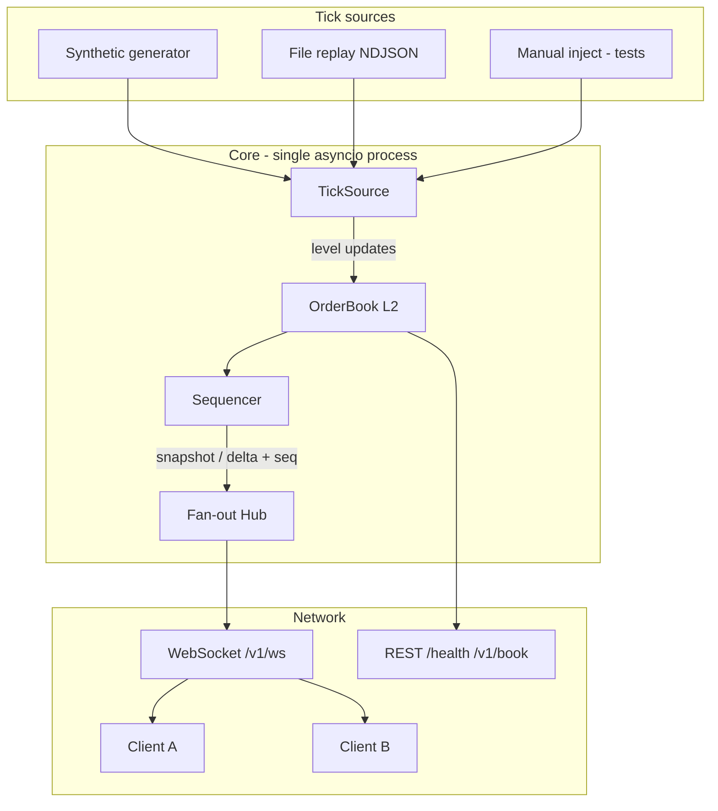
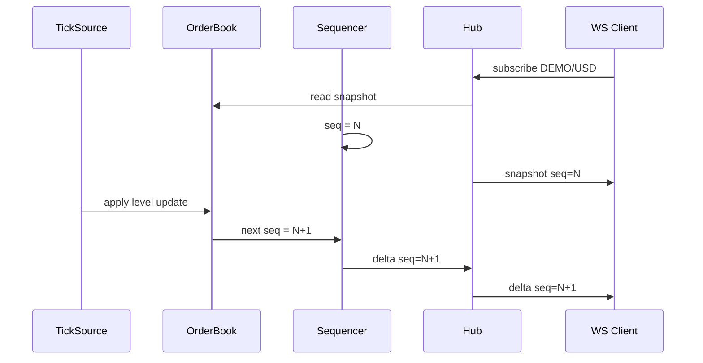

# Architecture

**Product:** Live Orderbook Feed  
**Version:** 1.0

---

## 1. Components



| Component | Responsibility |
|-----------|----------------|
| `TickSource` | Produce book mutations; never talks to clients |
| `OrderBook` | Price-level maps; apply update; export top-N snapshot |
| `Sequencer` | Assign `seq` for every outbound book message |
| `Hub` | Per-client queues; broadcast; slow-consumer disconnect |
| `WS` | Subscribe lifecycle; heartbeat; drain queues to sockets |
| `REST` | Health + read-only snapshot |

**Explicit non-component:** matching engine. Sibling: [mini-matching-engine](https://github.com/vikaspal1704/mini-matching-engine).

---

## 2. Data flow (happy path)



1. Client connects and sends `subscribe`.
2. Hub registers client queue, reads current book, assigns **current** `seq` (or next — see §4; locked below), sends **one snapshot**.
3. Feed task applies ticks → book → new `seq` → **delta** enqueued to all subscribers.
4. Per-client writer sends JSON text frames.

---

## 3. In-memory L2 book

- Keys: integer **price** (ticks); values: integer **quantity** (lots) at that price.
- Sides: `bids` (map), `asks` (map).
- Update semantics: set quantity at `(side, price)` to `new_qty`; if `new_qty == 0`, **delete** the level.
- Snapshot: top `BOOK_DEPTH_LEVELS` bids sorted **descending** by price; asks **ascending**.
- No order-id FIFO queues here — this is **aggregated L2**, not an exchange order book of resting orders.

```
apply(side, price, qty):
  if qty == 0: delete level
  else: levels[side][price] = qty
```

---

## 4. Protocol: snapshot vs delta & sequence numbers

### Sequence space (locked)

- One process-global monotonic integer `seq`, starting at **1**.
- **Every** book-derived outbound message (`snapshot` or `delta`) consumes exactly one new `seq` **or** reuses the book’s “last applied seq” consistently as follows (**locked rule**):

| Event | `seq` rule |
|-------|-----------|
| First book state at startup (empty or seeded) | After seed/init, `last_seq = 0`. No message yet. |
| Tick applied | `last_seq += 1`; that tick’s **delta** (if any subscribers) uses `seq = last_seq`. If no subscribers, still advance `last_seq` so REST snapshot can report `seq`. |
| Client subscribe | Send `snapshot` with `seq = last_seq` (**same** seq as current book version — does **not** bump seq). If `last_seq == 0` (no ticks yet), send snapshot with `seq = 0` meaning “empty initial book”, OR bump by emitting a synthetic no-op — **locked: allow `seq = 0` only for empty pre-tick snapshot; after first tick, `seq >= 1`**. |

**Client invariant:** After subscribe, the next `delta` must have `seq == snapshot.seq + 1` when `snapshot.seq >= 1`. If `snapshot.seq == 0`, the first delta is `seq == 1`.

**Gap detection:** Client stores `last_seq`. On message with `msg.seq > last_seq + 1` → gap → reconnect or `resnapshot` (COULD). On `msg.seq <= last_seq` for deltas → ignore duplicate / stale (should not happen on a single stream).

### Snapshot

- Full top-N bids and asks + `symbol` + `seq` + `ts` (UTC epoch ms).
- Sent on subscribe (and optional resnapshot).

### Delta

- One or more level changes: each change is `{side, price, quantity}`.
- v1 **locked:** one delta message may contain a `changes` array (1..k changes from a single tick). All share one `seq` (the book version after applying that tick).
- `quantity: 0` removes the level.

### Heartbeat

- Does **not** advance book `seq`.
- Fields: `type`, `ts`, optional `server_time`.

---

## 5. Fan-out, reconnect, backpressure

### Fan-out

```
on_book_event(msg):
  for client in subscribers:
    try:
      client.queue.put_nowait(msg)
    except QueueFull:
      schedule_disconnect(client, reason=SLOW_CONSUMER)
```

Writer task per client:

```
while connected:
  msg = await queue.get()
  await ws.send_json(msg)
```

### Reconnect

1. Client TCP/WS drops or heartbeat timeout → client opens new WS.
2. Client sends `subscribe` again → **fresh snapshot** at current `last_seq`.
3. Client replaces local book with snapshot; resumes applying deltas with gap checks.

Server does **not** replay historical deltas (no persistence). Snapshot is the recovery mechanism.

### Heartbeats

- Server task: every `HEARTBEAT_INTERVAL_SEC`, enqueue heartbeat to each client (or send directly if preferred — enqueue is fine and subject to same queue limits).
- Client SHOULD treat “no message of any type for `3 * HEARTBEAT_INTERVAL`” as dead connection.

### Slow consumer (locked policy)

- `CLIENT_QUEUE_MAX` default 64.
- On overflow: send optional `error` `SLOW_CONSUMER` if possible; close with WebSocket code **1013**; remove from hub.
- Healthy clients must continue to receive messages without waiting on the slow one.

---

## 6. REST vs WS

| Path | Role |
|------|------|
| `GET /health` | Liveness: process up + feed task alive flag |
| `GET /v1/book/{symbol}` | Current snapshot JSON (`seq`, bids, asks) — same payload body as WS snapshot without requiring WS |
| `WS /v1/ws` | Streaming subscribe |

URL-encode symbol: `DEMO/USD` → `DEMO%2FUSD`.

---

## 7. Full worked example — client subscribe → snapshot → deltas

**Assumptions:** Fresh server; synthetic/manual ticks; symbol `DEMO/USD`; depth ≥ 3.

### Step 0 — Server start

- Book empty; `last_seq = 0`.
- Feed task running (manual mode for this example).

### Step 1 — Client connect

```
Client → WS connect: ws://localhost:8000/v1/ws
```

### Step 2 — Subscribe

Client sends:

```json
{
  "type": "subscribe",
  "symbol": "DEMO/USD",
  "client_id": "example-client-1"
}
```

Server registers client, reads book (still empty), sends:

```json
{
  "type": "snapshot",
  "symbol": "DEMO/USD",
  "seq": 0,
  "ts": 1760000000000,
  "bids": [],
  "asks": []
}
```

### Step 3 — First tick (seed bid)

Manual/synthetic tick: set BID price `100` qty `5`.

- Book: bids `{100: 5}`, asks `{}`
- `last_seq = 1`
- Fan-out delta:

```json
{
  "type": "delta",
  "symbol": "DEMO/USD",
  "seq": 1,
  "ts": 1760000000100,
  "changes": [
    {"side": "BID", "price": 100, "quantity": 5}
  ]
}
```

Client applies: local book bids `100 → 5`.

### Step 4 — Second tick (ask + widen bid)

Tick: set ASK `101` qty `3`; set BID `100` qty `8`.

- `last_seq = 2`
- Delta:

```json
{
  "type": "delta",
  "symbol": "DEMO/USD",
  "seq": 2,
  "ts": 1760000000200,
  "changes": [
    {"side": "ASK", "price": 101, "quantity": 3},
    {"side": "BID", "price": 100, "quantity": 8}
  ]
}
```

### Step 5 — Third tick (remove level)

Tick: set BID `100` qty `0` (remove); set BID `99` qty `4`.

- `last_seq = 3`
- Delta:

```json
{
  "type": "delta",
  "symbol": "DEMO/USD",
  "seq": 3,
  "ts": 1760000000300,
  "changes": [
    {"side": "BID", "price": 100, "quantity": 0},
    {"side": "BID", "price": 99, "quantity": 4}
  ]
}
```

Client local book after apply:

```
Bids: 99 × 4
Asks: 101 × 3
```

### Step 6 — Late subscriber (reconnect / second client)

New client subscribes. Server sends **snapshot** at current seq (no seq bump):

```json
{
  "type": "snapshot",
  "symbol": "DEMO/USD",
  "seq": 3,
  "ts": 1760000000400,
  "bids": [{"price": 99, "quantity": 4}],
  "asks": [{"price": 101, "quantity": 3}]
}
```

Next tick will be `delta` with `seq: 4`. Client checks `4 == 3 + 1` ✓.

### Step 7 — Heartbeat (interleaved anytime)

```json
{
  "type": "heartbeat",
  "ts": 1760000000500
}
```

Does not change `last_seq` or local book.

### Step 8 — REST read (optional check)

`GET /v1/book/DEMO%2FUSD` → same bids/asks/`seq` as current snapshot body (`type` field may be omitted on REST; see API_CONTRACT — REST uses identical book fields with `"symbol"` and `"seq"`).

This sequence MUST be coverable by `test_worked_example_subscribe_snapshot_deltas` (see TEST_PLAN).

---

## 8. Complexity / performance notes

| Op | Cost |
|----|------|
| Apply one level update | O(1) dict set/delete |
| Build snapshot top N | O(P log P) sort of prices or maintain sorted structure; N small |
| Fan-out to C clients | O(C) enqueue |
| Slow client | O(1) drop that client |

Optimizations optional; **protocol correctness first**.

---

## 9. Explicit non-architecture

- No durable message log / replay beyond optional file tick source  
- No cross-process fan-out  
- No matching, fees, or order IDs in the book  
- No venue adapter required for v1 acceptance
